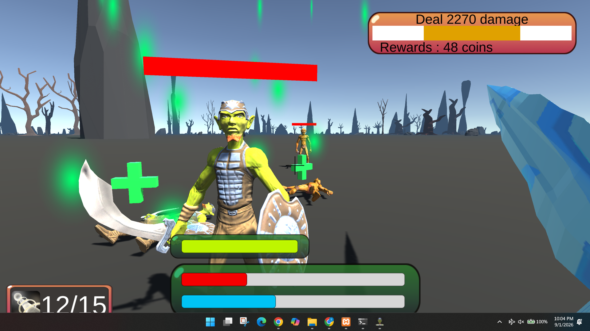
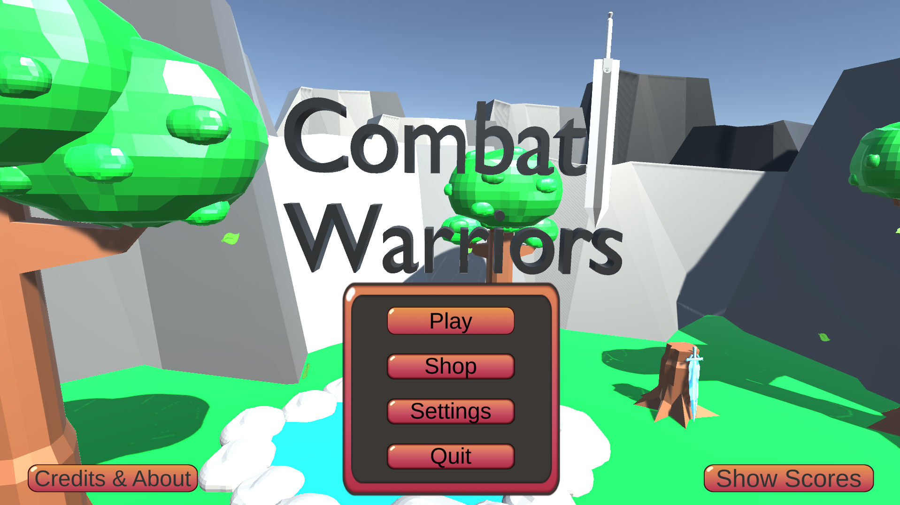
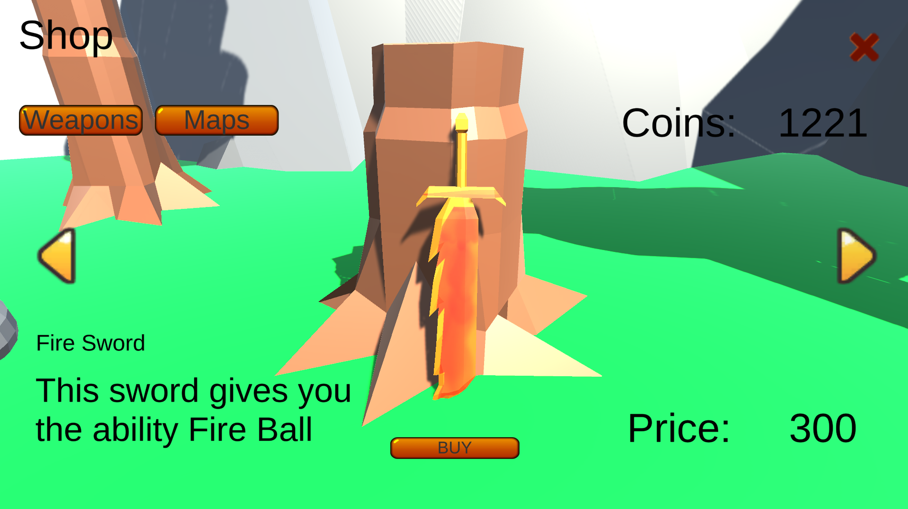
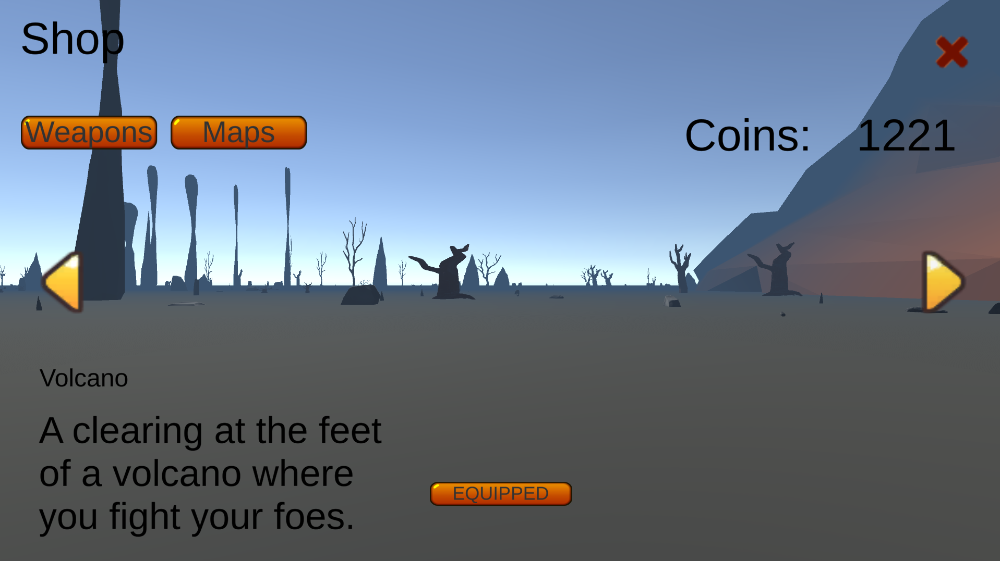
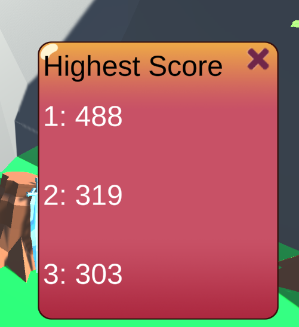
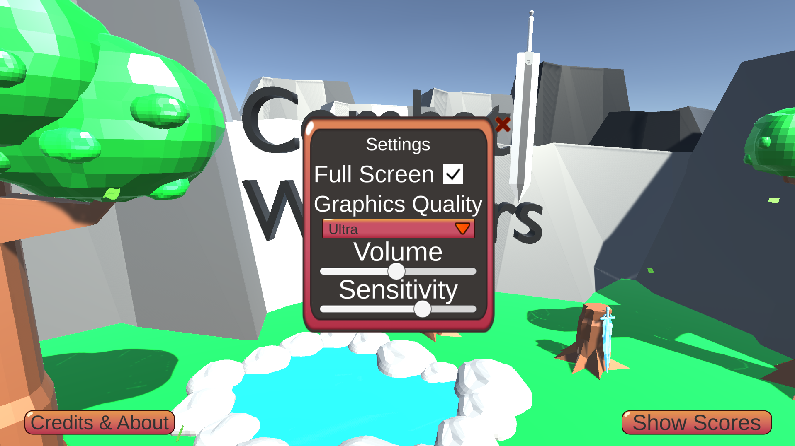

# 🎮 Combat Warriors

> A 3D combat game built with **Unity** and **C#**, featuring player movement, combat mechanics, interactive environments, weapons, and a score system.

<p align="center">
  
</p>

## 📖 About

**Combat Warriors** is a 3D combat game developed using Unity and C#. The project focuses on creating an interactive gameplay experience with combat, weapons, player movement, scoring, and an in-game environment.

The project allowed me to develop practical experience in **game development, C# programming, Unity's game engine, gameplay mechanics, and user interaction**.

## ✨ Features

* ⚔️ 3D combat system
* 🎮 Player movement and controls
* 🗺️ Interactive game environment
* 🔫 Weapon system
* 🏆 Score system
* 🛒 In-game shop
* ⚙️ Settings menu
* 🎯 Interactive gameplay

## 🛠️ Technologies

| Technology        | Purpose                             |
| ----------------- | ----------------------------------- |
| **Unity**         | Game engine and 3D development      |
| **C#**            | Gameplay programming and game logic |
| **Visual Studio** | C# development                      |

## 🎮 Controls

| Key / Input           | Action       |
| --------------------- | ------------ |
| **W A S D**           | Move         |
| **Mouse**             | Look around  |
| **Left Mouse Button** | Attack       |
| **Space**             | Jump         |
| **Esc**               | Pause / Menu |

## 📸 Screenshots

### Main Menu

<p align="center">
  
</p>

### Gameplay

<p align="center">
  
</p>

### Weapon Shop

<p align="center">
  
</p>

### Map Shop

<p align="center">
  
</p>

### Score System

<p align="center">
  
</p>

### Settings

<p align="center">
  
</p>

## 📥 Download & Play

### Windows

Download the latest playable version from the GitHub Releases page:

**[⬇️ Download Combat Warriors](../../releases/latest)**

1. Download the ZIP file.
2. Extract the ZIP.
3. Open the extracted folder.
4. Run **`Combat Warriors.exe`**.

> **Note:** The game is currently available for Windows.

## 🚀 Project Highlights

* Unity's 3D game development environment
* C# scripting
* Player movement and gameplay logic
* Combat and weapon mechanics
* UI and menu systems
* Game scoring
* Interactive environments
* Building and packaging a Windows game

## 📂 Repository Contents

```text
Combat-Warriors-Game/
│
├── screenshots/
│   ├── gameplay.png
│   ├── main.png
│   ├── scores.png
│   ├── setting.png
│   ├── shopmap.png
│   └── shopweapon.png
│
└── README.md
```

The playable Windows build is distributed through the **GitHub Releases** section.

#
